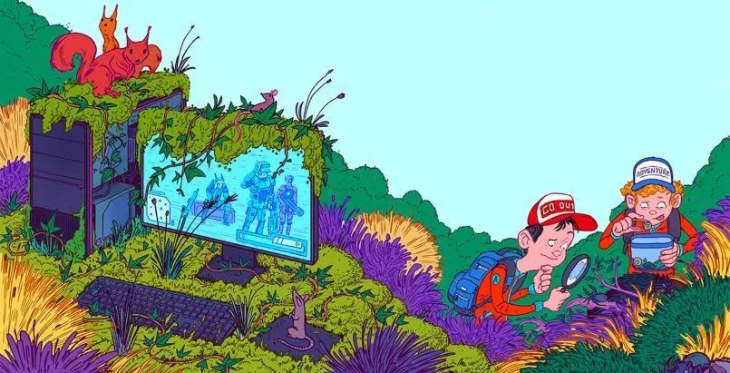

封面图：现实与虚幻的颠倒，孩子们应该去探索这个世界，而非沉迷于虚幻网络

这里说的“丧尸文化”，不是指电影里的丧尸片，而是越来越多的人活成了“丧尸样”——在聊完资本主义和消费主义后，很多人留言希望深入分析这种渗透在现代社会中的亚文化现象，它看似无形，却正在悄悄影响着无数人的生活状态。

一、“丧尸”的核心特征：只追基础刺激，毫无高级目标

一只标准的“丧尸”是什么样？一句话就能概括：只接受基础刺激，就像电视里的僵尸只痴迷血肉，对其他一切视而不见、充耳不闻。

放到现实生活中，“丧尸样”的生活有着鲜明的标签：生活重心全集中在玩游戏、刷短视频、看娱乐八卦等即时性娱乐上，只为追求短暂的感官快感，没有长期目标，更没有自我成长的诉求。他们的人生只有基本需求的满足，没有高级追求的支撑——时刻激一时爽，一直刺激一直爽，循环往复，乐此不疲。

在新时代里，吸毒这种危害社会的行为早已被严厉禁止，但“电子鸦片”却随处可见。智能手机、游戏机、平板电脑等设备，让大脑被愉悦感连续“电击”——整天成为常态，甚至有人调侃“今天你‘电’了没有？”更值得警惕的是，“丧尸”的生活状态不会主动变好，他们本身也无意改变现状，甚至不会去思考“如何让生活更好”这件事——对他们而言，维持当下的舒适与刺激，就是生活的全部意义。

二、丧尸文化的传播路径：与社会稳定度正相关

丧尸文化的传播有着清晰的路径：它最早起源于欧洲，随后传入美国并逐渐本土化，再扩散到日本形成独特的亚文化形态，近几年正式登陆我国，如今已发展到小有规模的程度。不出意外，它将持续影响上亿人的思维方式，最终成为主流的亚文化之一。

从这个传播轨迹中，我们能清晰地发现一个核心规律：社会越稳定，丧尸文化越繁荣。

顺着这个规律进一步推导，就能得出更深刻的结论：

历史上的大部分时期，“丧”才是人类生活的常态——只有少数战乱、灾后重建等社会剧烈动荡的“大颠簸时代”，人们才会反常地充满干劲，秉持着“多快好省、力争上游”的信念，为了生存和改变命运而拼命奋斗；

社会稳定之后，阶级固化会逐渐成为必然趋势（无论回顾人类历史，还是横向对比当下的发达国家，这都是普遍存在的现象）；阶级固化形成后，绝大部分人会慢慢接受现实，放弃那些遥不可及的梦想。

就像我们小时候，总有着各种各样的憧憬：想当飞行员、想当科学家、想当将军，但随着年龄增长，在现实的打磨下，我们会无奈地发现这些目标太过遥远。于是，目标一降再降，从“改变世界”到“立足社会”，再到“安稳度日”，最后慢慢变成“过一天算一天”。而其中一部分人，会在这个过程中更进一步，不仅“过一天算一天”，还变本加厉地追求即时快感，怎么爽怎么来，最终活成了“丧尸”的模样。

其实，“放羊一生孩子一孩子继续放羊”的循环模式，从来都不只是某个偏远村庄的专属，而是遍布全世界的主流生活状态。平淡、枯燥、年复一年的重复，才是大多数人的人生底色。反而那些充满急剧变化的生活，要么出现在战乱国家，要么出现在战乱后几十年的重建期。从这个角度来看，不求上进才是跨文明的核心文化，而力争上游、终生奋斗，永远只是少数人的非主流选择。既然不求上进是主流，自然就需要配套的文化形态来承载，这就是我们所说的丧尸文化——只不过有些人“感染”得深，有些人感染得浅而已。

这里需要明确的是，我们并非要批判这种人生态度，每个人都有选择生活方式的权利。我们只是想客观分析其成因，同时为那些不想被“感染”、或者想从“丧尸状态”中挣脱出来的人，提供一些切实可行的思路。

三、为什么大部分人会停止努力？一眼望到头的生活，磨平了所有盼头

我们来做一个简单的心理游戏：你讨厌看电影被剧透吗？答案大概率是“是”——一旦知道了结局，看片的兴趣就会大打折扣，甚至觉得索然无味。过日子其实也是一样的道理，最让人感到乏味和无力的，就是“一眼能看到头”的人生轨迹。

成熟型社会的最大问题，恰恰就是人生的“透明化”和“确定性”：

从踏入社会的那一刻起，你就能大致预判自己未来的生活：小学、中学、大学、工作、结婚、生子、退休，每个阶段该做什么、能得到什么，都有固定的模板。这种没有未知、没有惊喜的人生，自然缺乏奋斗的动力；

随着互联网的普及，社会变得越来越透明。它不仅让你看清自己未来的路，还会通过各种渠道让你看到“不同轨道上的人”过着怎样的生活——那些出身优渥、资源雄厚的人，似乎毫不费力就能拥有你梦寐以求的一切。更残酷的是，它还会让你清晰地认识到“跨轨道有多难”；

这种“难”不是靠努力就能轻易克服的，而是由一道道硬性门槛构成的：很多高薪岗位明确要求“985/211学历”，甚至“QS排名前50院校背景”；很多赚钱的行业需要长期的资金积累或相关工作经历，普通人根本无法涉足；更有甚者，一些行业就像“逛不正经的按摩店”，需要熟人引荐才能获得入场资格，这直接把一大批人排除在游戏之外，连参与竞争的机会都没有。

当一个人发现，无论自己怎么努力，都很难突破现有的阶层，很难改变既定的命运时，努力的动力自然会慢慢消失。就像一拳打在棉花上，没有反馈，没有回应，久而久之，就再也不想抬手了。

四、中外对比：发达国家的“丧尸”困境，可能是我们的未来

很多人都向往发达国家的生活，不可否认的是，这些年国内与国外的差距正在以肉眼可见的速度缩小。用不了多久，我们也能过上类似西式发达国家的生活——唯一的差别可能就是人口基数和土地资源的限制，导致我们走到哪儿都会相对拥挤一些。

作者曾因工作原因频繁出国，在德国慕尼黑坐火车时就颇为惊讶：作为德国南部第一大城市、全国第三大城市，慕尼黑的火车站竟然还没有自己老家地级市的火车站大，但即便如此也完全够用。这也能看出，欧美的拥挤程度远远低于东亚，但相应地，他们也无法享受集中式发展带来的便利，比如高效的快递和外卖服务。

但我们在电视上看到的西方国家，大多是中产家庭的生活场景，很少有人关注底层群体的真实状态——事实上，发达国家的底层，比我们想象中更惨，他们的“丧尸化”程度也更严重：

冷战时期，西方为了对抗苏联，需要拉拢国内的中产阶级，通过改善福利待遇、提供上升通道等方式，让中产成为社会的稳定器。但随着苏联解体，西方失去了外部威胁，开始大规模向海外转移低端产业，导致国内制造业空心化，中产规模持续萎缩。而这些从中产坠落的人，并没有成为富人，而是加入了底层的行列，这在学术上被称为“中产坠落”。

对底层群体而言，上升通道几乎被完全堵死：想成功，要么像蜘蛛侠一样“基因变异”——变成天才，拥有超高智商，要么靠体育特长（比如身高2米以上去打篮球，身体强壮去玩橄榄球）获得大学奖学金，要么成为明星。

在美国，普通人谈论梦想时，大多会说“想当篮球明星”或“想当电影明星”，这背后其实是对阶级跃迁的朴素渴望，因为除此之外，他们几乎没有其他出路；

发达国家的公共资源分配，与税收直接挂钩。这意味着，你所在小区的治安好不好，周边的学校质量高不高，都直接体现在房价上：房价越高，房产税就越高，学校才能雇佣到更好的老师，教育质量才能提升，孩子们的升学率也会更高。反过来想，如果买不起好房子，就很难让孩子接受优质教育，也就很难打破“贫穷循环”——大概率会像父母一样，一辈子困在底层；

[反智主义](https://baike.baidu.com/item/%E5%8F%8D%E6%99%BA%E4%B8%BB%E4%B9%89%E7%90%86%E8%AE%BA/18260641)在底层群体中盛行：有数据显示，美国有1亿人不相信进化论，绝大部分人对知识充满鄙视。他们的大脑长期被商业广告和低俗综艺节目洗脑，只喜欢一些原始的感官刺激，比如大胸大屁股、可爱的宠物等。在美剧《生活大爆炸》中，普林斯顿大学的高材生娶了一个半文盲，观众们却觉得“这个博士赚了”，这种看似荒诞的价值观，正是反智主义的真实体现。

美国的文化变迁，也能清晰地印证丧尸文化的崛起：

二战时代的美国队长（漫威旗下角色）：他代表的是有责任心、有担当、崇尚牺牲、追求正义的精神。放在现实中，他就像部队里充满自我牺牲精神的政委，既有集体主义的光辉，又饱含自由主义的理想，总想去做点什么、要求进步，希望为人民服务。他的原型，正是国运上升期的美国人；

后来的钢铁侠：他出身豪门，是个花花公子、嬉皮士，若不是意外被绑架到阿富汗山区，接受了恐怖分子的“精神改造”和当地贫下中农的“再教育”，一辈子大概率会沉迷享乐、一事无成。他影射的是美国国力达到巅峰后，社会逐渐失去理想，年轻人开始信奉“make love not war”（要爱不要战争），只想享受生活，不想承担责任；

冷战结束后，新一代美国人在无忧无虑的环境中成长起来：他们没有经历过饥饿，没有感受过生存压力，不用担心核弹从天而降，也不用为了温饱而奔波。但同时，他们也面临着上升通道被堵死的困境——这辈子奋斗不奋斗，似乎过得都差不多。在这种情况下，他们自然慢慢向“丧尸”靠拢，沉迷于即时娱乐，放弃了对未来的规划。

美国的民族基因本是“积累、冒险、自我负责”：殖民地时代，人们靠种地为生，闲暇时祷告祈福，过着又迷信又清苦的生活；工业时代，美国在经济萧条和繁荣之间来回倒腾，经历了无数次危机与复苏。这200年的积累，形成了美国崛起的根基。但现在的美国社会，已经呈现出明显的分层：

上层群体：玩着复杂的资本游戏，通过基金会、跨国公司等方式，牢牢掌控着社会的核心资源；

中层群体：以家庭为中心，把大部分精力放在教育孩子上，希望孩子能维持现有的阶层，但对父母的养老却不太上心；

底层群体：虽然饿不死，但失去了奋斗的动力，开始输出各种“垃圾文化”。他们不是故意要传播这些文化，而是这些内容流动性强、传播门槛低，更容易被大众接受：把醉生梦死说成“享受当下”，把不积蓄甚至超前消费说成“洒脱”，把放纵不羁说成“放飞自我”。

更值得警惕的是，国内有些别有用心的，把黑人族群中“不好好学习、不负责任、不抚养孩子”的陋习，包装成“欧美主流文化”向国内灌输，让一些人误以为“西方发达就是因为这种放纵的生活方式”。这种误导极具迷惑性，但只要稍微有点判断力就会明白，谁信这些垃圾理念，谁就容易沦为“丧尸”，最终被社会淘汰。

五、丧尸与焦虑：两种极端，中间群体的选择至关重要

丧尸人群与国内近几年时髦的“焦虑型群众”，恰好是两个极端。如果用一张正态分布图来呈现，就能清晰地看到社会群体的划分：

最左边：丧尸群体，沉迷即时娱乐，毫无人生目标，对未来没有任何期待；

中间：无感群众，这是规模最庞大的群体，他们随时可能向两边滑落——如果内心有责任心、有上进心，就会滑向焦虑的一端；如果贪图安逸、放弃努力，就会掉进丧尸的坑里；

最右边：焦虑群众，他们看似每天都被压力包围，活得很痛苦，但实则内心没有放弃治疗，还在努力寻找出路，这种焦虑感，恰恰是他们不愿“丧尸化”的证明。

越成熟的国家，丧尸群体的比例就越高，而且还会主动对外输出这种“垃圾思想”。这背后的原因很简单：有些人心存“崇富心理”，觉得“有钱的国家做什么都是对的”，连发达国家的垃圾桶都显得很有韵味，垃圾桶里的东西也跟着变得“高大上”起来。比如前几年热议的某国内知名房地产大佬的红颜知己去英国谈论“贵族文化”，殊不知这种所谓的“贵族之说”，早已是西方社会扫进垃圾桶的糟粕，却在国内被一些人奉为圭臬，着实令人费解。

对中间的无感群众而言，选择至关重要。在这个信息爆炸、诱惑丛生的时代，保持清醒的认知和坚定的立场并不容易，但一旦做出选择，就会走向完全不同的人生：是在即时娱乐中消磨时光，最终沦为“丧尸”；还是在焦虑中寻找机会，通过努力实现自我成长？答案，就藏在每一个日常选择里。

六、自救指南：不想当丧尸，就别停下“行动”的脚步

如果已经活成了丧尸还乐在其中，那不必去找找，毕竟每个人都有选择生活的权利；但如果像丧尸一样放纵自己，内心却充满负罪感，没法开开心心、踏踏实实做个丧尸，想改变却不知道从何下手，不妨试试以下这些经过亲身验证的方法——这些都是作者曾经走过弯路、踩过坑后总结的经验，希望能给你带来一些启发。

1.直面“懒癌”：危机感是最好的动力

新时代的“懒癌”，早已不只是“不想干活”那么简单，它更表现为“怕这怕那”的逃避心理：今天怕大环境要崩溃，明天怕未来充满不确定性，后天怕努力了也没有回报。而这一切的根源，在于生活过得太舒服，没有了危机感。

几年前，作者也曾有过一段懈怠期：工作按部就班，没有什么压力，每天下班就玩游戏、刷视频，日子过得浑浑噩噩。直到公司开始大规模裁员，而且明确表示“今后每年都会优化人员结构”，后来作者当上了小领导，又传来“要专门裁中层领导”的消息，他才彻底坐不住了。那段时间，每天都在想“如果被裁了，我能做什么？我有什么核心竞争力？”这种危机感让他再也不敢懈怠，开始主动学习新技能、拓展人脉，反而觉得日子过得充实而有意义。

现在回头看，作者越来越深刻地体会到：宏观环境确实会影响每一个人，但它只会伤害那些“虚的人”——那些没有核心技能、没有积累、只想着躺平的人。大部分人之所以“不行”，并不是因为个体差异有多大，而是因为他们从未真正努力过，从未体验过“全力以赴”的感觉。

2.参考真实案例：行动永远比空想更有用

作者有个远方亲戚，前几年从老家来到北京打拼。他之前在家跟着工程队码砖，干了几年后觉得没什么前途，就转行去送快递。送了一段时间快递后，他发现送外卖收入更高（尤其是晚上的订单，补贴多、单价高），于是又改送外卖。为了多赚钱，他每天从早上8点干到晚上11点半，几乎全年无休。

就这样干了两年，他攒下了一笔钱，买了一辆金杯车，在北京五环外搞起了搬家公司。作者写这篇文章的时候，偶然在朋友圈看到他招工，就问了几句，才知道他现在已经有了3辆金杯车，手底下雇了5个员工，每天忙得喘不过气来，而且还在老家县城开了一家快递站，生意做得有声有色。至于收入，自然也相当可观，远远超过了当初在工程队码砖的水平。

这个亲戚的案例告诉我们：改变命运的从来不是空想，而是实实在在的行动。没有谁的成功是一而就的，都是从最基础、最辛苦的工作做起，一步一个脚印积累出来的。与其整天抱怨大环境不好、自己没机会，不如脚踏实地做点实事——哪怕是送外卖、跑快递，只要肯努力、肯坚持，也能闯出一片天地。

3.警惕语言的力量：别被“丧话”催眠了自己

语言有着强大的暗示力量，一句话说出口，最先听到、最先被影响的就是你自己。如果经常说一些很丧的话，比如“我不行”“这辈子就这样了”“努力也没用”，慢慢就会真的相信这些话，变得越来越丧，越来越没有动力。

反之，如果经常给自己正面的心理暗示，比如“我可以试试”“再坚持一下”“今天又进步了一点”，就会慢慢建立起自信，变得越来越积极。所以，一定要注意自己的表达方式，少传播负面情绪，多给自己一些鼓励。当你习惯用积极的语言看待问题时，你会发现，生活也会慢慢变得不一样。

4. 建立基本常识：危机淘汰的是脆弱者，不是努力者

很多人都害怕危机，觉得危机来了，大家都会一起倒霉。但事实恰恰相反：每次危机来临，从来都不是“均贫富”的机会，而是“优胜劣汰”的筛选过程——消灭的是那些现金流脆弱、缺乏核心竞争力、不愿努力的人，而崛起的都是内心强大、敢于拼搏、善于把握机会的人。而且，危机还会让真正的巨头变得越来越大，因为他们有足够的资源和能力吞并弱小的竞争对手。

对那些好吃懒做、只想躺平的“丧尸”而言，危机跟他们没什么关系——他们永远都是围观者，只会在旁边看热闹，等着别人倒霉，却从未想过自己要主动改变。其实稍微有点常识就知道，这个世界上从来没有不劳而获的成功，也没有永远的困境，关键在于你是否愿意行动、是否愿意努力。

5. 大胆行动：宁肯焦虑，也别躺平成丧尸

很多人都有这样的误区：做一件事之前，必须把所有计划都制定得完美无缺，把所有风险都考虑到，才敢动手。但现实是，绝大多数计划周密、投入巨资的项目，往往因为前期消耗太大，还没等到盈利就把现金流耗光了，最终以失败告终。

反而那些一开始只是“不小心接触”“抱着试试的心态”去做的事，往往能慢慢做起来。因为这类事情的试错成本低，即使失败了也不会损失太多，而且能在实践中不断调整方向、优化方法，最终找到适合自己的道路。

所以，如果你觉得自己越来越丧，想自救，就赶紧动起来——给自己制造一点危机感，去冒一点能承受的风险，不要怕失败，不要怕犯错。宁肯滑向焦虑的那一端，也不要掉进丧尸的坑里。焦虑并不可怕，它说明你还在乎自己的未来，还想改变现状。

再过一些年，当我们回头看就会发现，现在正是最好的时代，正是动手做事的黄金时期。就像那句话说的：“种下一棵树，最好的时间是30年前，其次是现在。”无论你现在处于什么状态，无论你多大年纪，只要愿意行动，就不算晚。

不要让自己在即时娱乐中慢慢沉沦，不要活成“丧尸”的模样。人生的意义，从来不是日复一日的重复和短暂的感官刺激，而是在努力的过程中不断成长、不断突破，最终活成自己想要的样子。希望我们都能保持清醒的认知，坚守内心的追求，拒绝“丧尸化”，在这个充满机遇和挑战的时代，活出自己的精彩。