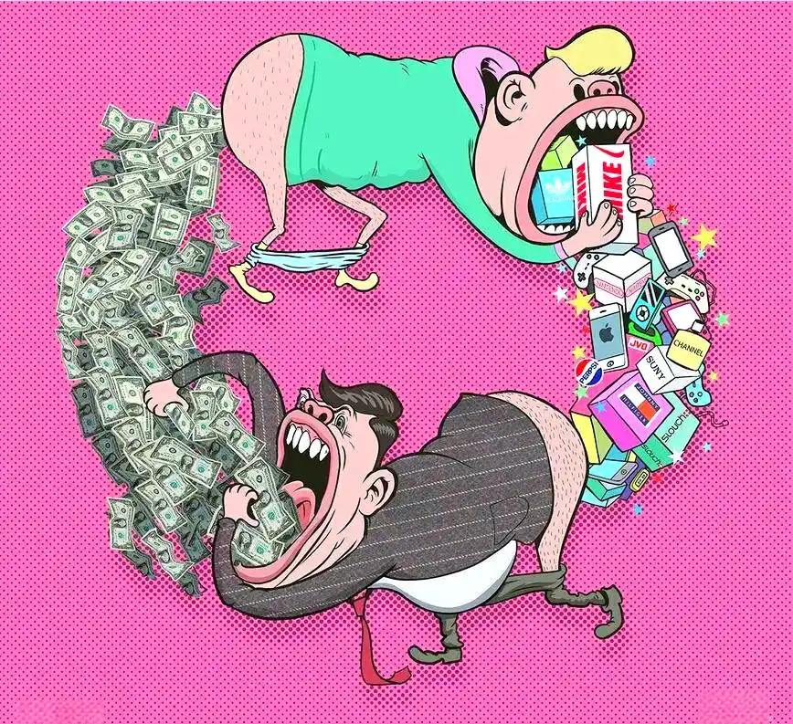
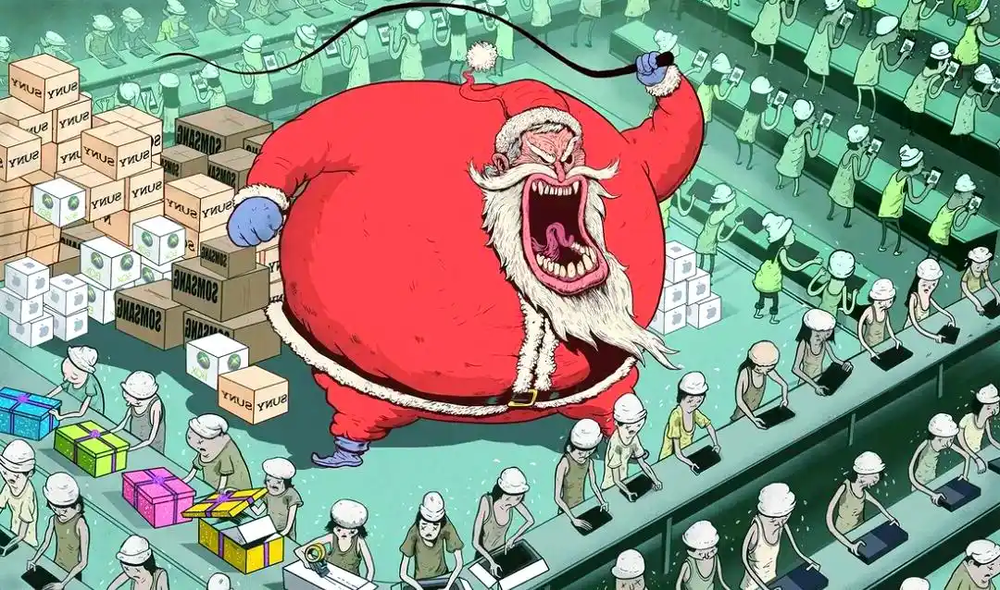

封面图：人们在消费流水线上不知疲倦地购买商品，而金钱在这个循环中消亡又再生，描述了消费主义的无限延续

第一，你在养谁的爹？

一个睿智的人曾经说过，如果你在大城市没有买房，把所有的钱都用来买包包、买衣服，然后身无长物地离开了大城市，那么在这种情况下，你就是大城市的消耗品。我们知道城市和人一样，是个逆熵体。

说到这儿，这个逆熵体又是个什么东西呢？首先大家要知道什么是熵增，熵增就是简单地说就是掉坑里了。根据热力学第二定律，这个世界上万事万物都有掉坑里的趋势。着火的木炭会熄灭，新鲜的牛肉会腐烂，漂亮的美女会变老，房子没人照料会破败，恒星会坍塌，连黑洞都会有寿命，倒霉了，寂灭了，就是熵增了。

熵增是宇宙中的魔鬼，就跟死神一样永远不死，拿着个镰刀在那里等着收割牛肉和美女以及一切。但是有些东西在一段时间内是不熵增的，比如生命，比如城市、经济体、公司等等。按理说这些东西都会变成渣才对，但是这些东西在一段时间内不但没有掉进坑里，反而顶着熵增的压力在成长。

那么这又是怎么回事呢？因为它让别人熵增了，或者说它让别人倒霉了。也就是说，生命体和城市是一样的，在消耗别的东西，达成自己的“逆熵”和壮大。人要吃饭，吸收了牛排的能量，人就变强壮了，牛排加速变成渣。一座房子需要里面的人不断花时间和精力修复它，它才能保持住不破败，甚至经过装修后熠熠生辉。城市也一样，一座城市要运行，要有大量的电力，还需要更多的人力，消耗电力，消耗别人的青春，城市就拔地而起了。

这里就有个问题，叫“成本谁来承担的问题”。理论上讲，城市里的每一个人都在承担成本，但是各自承担的又不一样。有点像以前说的那件事，你去上班赚钱，工资一万到手八千，如果你家有老人在拿政府退休金，你的那两千块相当于转了一圈又回到你家了。但是如果你家没有这样的老人，你相当于去养别人的爹了。

我们今天说的这个逻辑也是一样的，每个人都是城市的消耗品，但是一部分人同时又是城市的受益者。有点像那个说法，人人平等，但是有些人更平等一些罢了。比如大家同心协力，让城市变得更美丽，但是如果你家有房有公司，美丽的城市里房子涨价了，经商环境变好了，这样你的付出一定程度上从房子和公司那里又回来了，有点像你交的税被你爹给赚回来了。或者说政府修地铁修到你家楼下去了，这玩意是政府税收搞出来的，但是你房价应声上涨。或者你有个水果摊，附近建了地铁站，分分钟流量爆满，你还得扩大规模。

但是如果你没房子没资产没水果摊，那你的付出变成别人的资产增值了，养了别人的爹，是不是很惊喜？当然了，不是给大家提建议说赶紧去买房，太狭隘了，而是说大家做什么事，都要分析下利弊，看看哪些事是在养别人的爹，哪些事是在养自己的。而消费主义，就是这样一个坑，提倡追求短期享乐，自己觉得自己及时行乐了，其实是给别人养爹，自己还不知道，还挺开心。

第二，今天你的脑子被洗了吗？

如果非要排列一下人类历史上靠想象力营造出来的三个好东西，我列出了下面的三个：钻石、82年的拉菲、爱马仕。当然，我只是提供一种思路，到底什么东西最牛，大家可以自己想想，没有统一答案。

我们上面所说的这三个东西的内在价值都非常难说怎么理解。首先，钻石就是个世纪骗局，那东西一点用都没有，而且分割性极差，不能当做货币，储存量高到离谱。它可不是广告上说的，只靠了一句洗脑广告和垄断共谋，一直来保持高价。事实上，你从钻戒店买个钻戒，再去二手市场上卖，那才是钻石的真实价格，你看看到底这东西值多少钱，你就明白了。

咱们看了很多国外的纪录片，还有国内的纪录片，会看到那种大型的露天矿里有那种天量级的大型挖掘机，甚至比一辆重型卡车还要大好几倍。你一眼看过去，你肯定觉得那东西一定是不便宜。哪怕你不知道这东西是干嘛的，你也依旧知道应该是价格不菲。

但是如果这个时候你眼前放着一瓶82年的拉菲，你能确定价格到底是多少吗？因为你自己也尝不出来这玩意儿到底是真是假的。事实上你可能这辈子都不知道这瓶子里面它到底装的是什么东西。而且真正具体到82年的拉菲产量其实就20万瓶，82年随后每年卖的都有二十多万瓶。我就不知道大部分人喝的到底是什么东西了。

每年几乎都有人搞这个红酒盲测。大家谷歌一下就能看到，有个心理学家叫做理查德·怀德曼，做了一个用红酒的评测实验。他选了红葡萄酒、白葡萄酒和香槟酒三类，每一类都挑一瓶贵的和一瓶便宜的，然后让志愿者来猜哪一瓶是贵的。实验的结果也令人吃惊，53%的品酒者能成功的选对更贵的酒。但是要知道扔这个硬币的成功率它都有50%。品酒者的这个成绩只是略好于扔这个硬币的53%。

更要命的是在红酒分类下，品酒者的成功率只有39%。这什么意思？也就是多数人都认为便宜的酒可能更好喝。此外还有著名的阳澄湖大闸蟹，微博上之前有人搞过挑战赛，这个吹牛逼能尝出阳澄湖大闸蟹的那个博主，当场就被打脸了，后来就再也没有人敢吹这个牛了。

说到这儿大家应该明白了，很多东西换了环境并不影响它的价值，但是还有很多东西换了个包装立刻就价值暴跌了，因为产品本身跟价格它是脱钩的。至于爱马仕包包，它就更这样了，你从店里拎出来再去卖，可能这辈子也卖不到原价了，尤其是你没法证明这玩意儿是不是正品的情况下。问题是刚才咱们说的那个大挖掘机，它需要证明自己是正品吗？很明显的是，这段时间热炒的鞋，这个具体哪个品牌我不多说了，今天早上还看了一下，原价2000的鞋炒到了15000，那这两天又落回去了。也就是说施加在鞋上的故事一度值13000。现在这个故事遭到质疑了，鞋价就迅速崩溃了。至于爱马仕和82年的拉菲，由于生产方一直很克制，而且套路得当，人家的故事还可以这么玩很多年。

说了这么多，咱们简单总结一下，挖掘机的价值是凝固在产品本身上的。而我们上文提到的这些东西的价值本身是故事，剥掉故事本身东西一文不值。对着你讲了一个故事，你就掏高额的溢价，这全世界可能没有比这更划算的事儿了。当然讲个故事让你买也有点过分，它得配合其他套路。

讲这个之前，咱们先说另一件事儿，大家有兴趣也可以去观察，我经常往返国际机场，每次远远看到一群人都是亚洲面孔的，坐着不用听他们说话也能看出基本是从哪儿来的。比如所有人都带着夸张的笑容，那么这伙人基本确定是日本人；一群人嗓门比机场的电喇叭都大，那基本是韩国人；如果那群人跟村里来的似的，土了吧唧还都是大胖子，那八九不离十，那是从美国来的。说这个不是为了趁机损人家美国人，而是说美国比中国进入消费时代早得多，他们现在已经换了玩法了。我见过的所有外国人里面，对品牌最无感的，穿的最随意的应该就是美国人了。日本人早年疯狂买包，这几年不知道什么情况了，不过整体那种拜物教气质已经开始消散了，快要从坑里出来了。而中国人才刚刚进坑。

那么问题来了，您说的这个坑是个什么坑？咱们现在是在一个什么坑里？可以这么姑且的认为是上层社会准入妄想症。或者换句时髦的话就是说，你的消费就是你通过买衣服、买包包、买车，会产生一种爬到不属于自己阶级的错觉。通过消费让你自己觉得自己不是自己了，在精神层面上得到了升华。

因为市场经济做的第一件事就是对用户进行分级，按照消费能力分级，把用户分成好几层。首先是满足基本需求，比如大家买车的时候，8万的飞度基本就能解决90%的问题了，还好停车，但是逼格太低。然后要提供高质量的东西，比如20万左右的迈腾，你要说是装逼倒是谈不上，但是能在功能上更上一个层面吗？

再往上其实就开始务虚了，因为很多人对车的要求不再是单纯的代步了。有了泡妞谈生意等特殊需求，或者可能他就是单纯的钱多，不想跟别人一样。那么在这个背景下，超前消费造就了超前消费的人群，消费品给人贴上了标签。不可避免的是时间长了，大家就觉得一咬牙买一个高端消费品，自己地位就上去了。如果你要觉得那句话有道理，那么可能你的脑子就被洗坏了。

而且这些年有种坑人的言论，主张一辈子租房，还说是在西方比较流行的。拜托这玩意儿在西方黑人里边比较流行，你学谁不好，你学黑人？黑人普遍都没房，你要不要学一下？事实上在几乎所有的文化里，安居乐业、养育后代、稳定家庭，那都是主流和核心。非主流和边缘人可能声音比较大，但是长期看啊，谁信他们谁倒霉。

不过关于消费的这些奇怪观念，可能是长期推敲和演变出来的，并且可能符合人的一些底层的固件。所以说大家学得非常快，毕竟大家都有掉进坑里的趋势。找机会我们再讲讲这个掉进坑里的事儿。这几年各种消费贷配合这些垃圾观念玩得虎虎生威。

我认识一个妹子挺乖巧的。大学毕业前后发生了巨大的变化，一个普通家庭的女孩各种玩各种秀，欧洲各地游，果然欠了几十万的消费贷，并且也不知道他们最后是怎么解决的。后来一了解，这种情况现在到处都是，现在俨然已经成了新风尚了。

第三，为什么消费主义会害死人？

但是说到现在，咱们也没说什么是消费主义，但凡加上“主义”这两个字儿，其实就是中心或者是为什么什么至上。比如说消费主义就是消费中心论，或者是消费至上论。资本主义就是以资本增值为中心，社会主义就是以全社会的整体的福祉为中心。从这儿其实你也能看出来，社会主义和资本主义，其实他们并不是相反的，他们俩不相关。听明白了吗？资本主义是以增值为中心，社会主义是以全社会的整体福祉为中心。社会主义的对立面是自由主义，此外还有民族主义，就是以本民族为中心，还有帝国主义以帝国扩张压迫和剥削殖民地，就是这些主义，这才是社会主义的对立面。

说到这儿大家就明白了，消费主义强调生活的核心是消费，花钱就是最快乐的事儿，生活的目标就是追逐消费的快感。当然了，估计那种超前消费到2022年的人都不一定承认自己生活的目标是享受消费的快乐。这也就是说你这是这么做的，但不一定会承认自己是这么想的，得狠狠地做自我剖析和自我批评，才能挖掘出来内心的真实想法。

资本主义和消费主义是一个硬币的两个面。资本主义的核心指的是赚到的钱别花，或者是花掉很少量的一部分，剩下的投入到资本增值中去。这里的资本增值，你可以是开店，也可以是投资，也可以是放高利贷。而跟资本主义对立的消费主义的核心却是买买买，把前者生产出来的东西都买了，或者前者放出来的高利贷你都给贷了。他们俩只有同时存在，经济才能运转起来。一开始那边生产是很痛苦的，但是慢慢的随着资本规模的越来越大，每次拿出一小部分他都花不完。消费这一边是一开始非常爽，越往后越是被动，最后掉坑里了。等到可出卖的劳动力慢慢不值钱了，自然没有办法维持之前的消费能力，越过越坑。

说到这儿您就会问了，有救吗？其实关键是树立正确的核心价值观，而且在实践中反复去强化它。

在作者的老家就是山西那边有一个现象，山北面的大户都是从明清开始就是大户人家，后来就被革了命了。比如作者那边有个大户，明朝开始他们家就拿着朝廷的盐引跟明朝的边军送粮食，到了清朝，成了八大皇商的一个分支。到了民国，尽管衰退了一部分，但依旧是阎锡山晋军的重要的资助方。他们家有好几十口人在晋军中当军官，太原战役是他们家的转折，一下子被打回到原形了，回到了七百多年前的水平了。

说到这儿，咱们多说一句，绝大部分人其实根本不知道毛主席带领的咱们中国共产党对这个国家的影响有多么大。如果没有他们那样的大手笔，把中国深深地犁耕了一遍，中国现在其实跟印度差不多，这个国家上层有了固化了几百年的大受益阶层。普通人也就凑合着过，天天聊点什么梁思成林徽因他们家那点豪门的花边事儿。不过有意思的是啊，刚才咱们说的这些大户在改革开放之后，一定程度上又迅速地又爬起来了。就是刚才作者提到的那家子，尽管离他们家族巅峰时刻还差十万八千里，但是现在他又成了地方上的大户了，在高考和做买卖方面都有进展。非常明显的大跨越。这些事儿在后来的一些江南地区也出现了这种情况。

作者在文章里贴了一张影视剧的截图，就是冯小刚拍的《1942》。其中已经破落，跟随着流浪部队一直在流浪的那个张国立扮演的大地主，跟着旁边的一个人在说，我知道怎么从一个人变成财主，不出十年，不出十年，你大爷我还是东家。作者想了很久，后来也想明白了，其实这其中最关键的就是一些核心价值观的灌输。比如真正的明白家庭，都会提前灌输关于资产、消费、成本、读书这些观念。这些都是有门槛儿的，只有少部分人懂这些东西，大部分人不但不懂，而且很难学得会。

著名的美剧《绝命毒师》里面，那个毒枭跟主人公老白说过，穷人不需要学，谁都会当穷人。但是他有没有说，富人是需要学习的。没掌握过大财富，没经历过白手起家晋升到豪门，中间再来几次大起大落，很多事是不会理解的。绝大部分人掌握不了财富的奥义，就像你不跟着项目经理做十几个项目，你也学不会怎么搞软件项目一样。

一些家庭到现在家长都弄不清楚这些东西，而且言不由衷。就算说的话靠上边儿去了，但是做的事完全是朝着反方向。比如有些家长知道孩子看电视玩这些电子产品不好容易脑残，但是他们不让孩子看，然后自己天天晚上两口子坐在电视机面前开心的不得了。还有很多家庭天天跟小孩说要读书，然后自己一本书都没看过。你说的跟做的不一样，小孩很容易精神分裂，最后发现自己的家长是个傻X，产生了一种幻灭感。家长说什么他们都不当回事，就当没听见。是的，绝大部分家长其实是不合格，儿子当兵要体检，读大学要高考，当公务员要国考，进公司要面试，唯独当家长这么大的事儿基本没门槛。这个没必要隐讳。

绝大部分基层小孩成才其实主要是靠自身努力，家长并没有帮上什么忙，尽管家长们感觉尽力了，尽力不代表你做好了。不过这些年新一代的大学生已经有孩子了，他们知道怎么学习，怎么样解决复杂的问题，也知道怎么给孩子做表率。对于其他那些父母是个糊涂蛋的孩子来说，这才是最狠的降维打击。

回到主题，关于教育、消费、积累、投资这些话题其实非常复杂，以至于需要一两代人慢慢琢磨，才能理出一些基本的观念，比如重视教育这件事，中国人在全世界已经算很重视的了，但是跟一个犹太人的同事聊天的时候，他说他们德意志犹太人是出了名的重视教育。最明显的一个操作是什么？父母看的书比孩子多得多，这样就算父母不提读书的事儿，孩子们也会自发地多读书。孩子会天生觉得父母做的事他都是对的。我以前讲过，犹太人有很多高成就的，主要就是德意志的犹太人。我觉得问题就是在这儿，并没有什么种族天赋，严格意义上的血统论。犹太人跟阿拉伯人是一个血统，很少有人说阿拉伯人脑子好，是不是？

消费观也是一样的。任何一个曾经闯过的家庭都知道，收入的绝大部分要投入到生产资料里面，少部分用来消费，资产能给人带来被动收入。也就是你的家，就是你家的爹让别人养着。

这个逻辑非常简单，但是做起来确实特别难，需要父母用十几年的时间给灌输进去。而且你得自己去实践，才能固化成你自己的观念。而且关键不是攒钱，是攒下来资产。我们现在很多人过得很节俭，但是没钱。很大的一个原因就是只懂得攒钱，但是不知道攒钱是为了干什么。绝大部分人甚至区分不了资产和消费。

比如倒退几十年，那个时候收入低，但是房子也便宜，而且没人跟你抢，而且大家都懵懂。不过问题是99%的人都是那个大家，这些年终于反应过来了，但是也只学会了追涨杀跌。

这个星球绝大部分事情的本质都是积累和爆发，积累是大家能控制的，攒的钱少那就买个小资产，攒的多了那你就买个大的，然后通过一波又一波的置换往上爬。如果能承担风险，就适时地赌一把。每隔五六年其实都有一个小浪潮，每隔十来年都有一个大浪潮，20年左右就有个滔天巨浪。大浪来的时候抓住机会爬上去也就翻身了。不过前提是你得有资本，而且要做一个靠谱的人。靠谱这个名字本身也是资产，它跟信用是一样的，关键的时候能帮上非常大的忙。此外还要多输出，多输出慢慢也会积累起一些链接。至于最后爆发，那个就得看人，也得看命。不过你没有积累肯定不会爆发，这个一定不要怀疑。

那么快到最后了，有人会问一个问题，你把这种东西说得这么清楚，这样分享，如果每个人都这样做了，是不是相当于谁都没做？其实想多了，这篇文章是六千多字，现在一般微信公众号不会超过3000字，为什么？三千字就是阅读的极限，超过这个极限，90%的读者都要放弃了。问题是能看完文章的人本身就不多，，大部分都是去看那种直接刺激大脑快感回路的小视频了，就是说看的人还真没几个，而且没有几个人能看完能听完。其次，看完听完对于绝大部分人来说也就没有什么用，该干什么还是干什么。