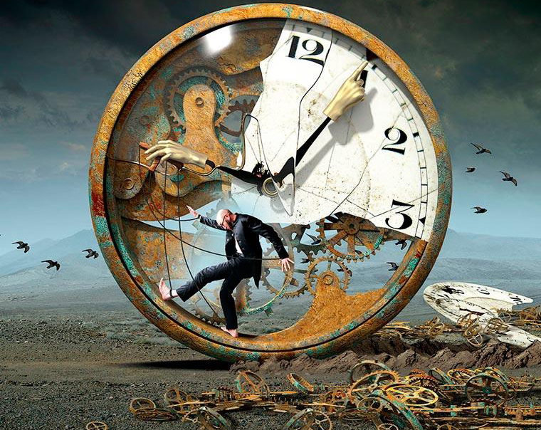

封面图：人掌控时间，还是时间掌控人呢？

有一段引发热议的表述：“底层群体的管理向来是各国政府的心病，核心态度就是‘不惹事即可’，哪怕多花点钱也无妨。关注过美国市长选举的人都能发现，翻来覆去离不开几个核心话题：降低犯罪率、给监狱增设教育设施，或是新建更多监狱。但最近几年，几乎所有严肃智库都给出了一个一致的‘药方’：游戏比刺刀管用。你不是精力无处释放吗？你不是内心的冲动想肆意宣泄吗？想搞破坏、想危害社会治安，不如圈在虚拟世界里玩游戏——在游戏里拿枪‘突突’人，总比在现实中犯下恶行要强。于是，‘奶头乐’应运而生，让大家在廉价的欢乐中安分守己，这便是所谓的全民同乐。”

​        正是这段话，让很多人希望再深入聊聊“娱乐”背后的逻辑。不知道你有没有过这样的体验：想在家安安静静看一本严肃的书，哪怕坐姿再舒服，环境再安静，看着看着就会不自觉地躺到沙发上刷手机；但在电影院里，3个小时的电影能轻松看完，可如果让你坚持3个小时读一本《货币金融学》，绝大多数人都会像我一样，很快陷入自我怀疑，忍不住拿起手机刷朋友圈、看微博、玩抖音，实在没事干就看看购物车里的东西有没有降价。

​    我们明明知道什么对自己有益，什么只是浪费时间，却始终无法克制——总想去做那些欢乐但没卵用的事，玩起这些来精力十足，可要做些有价值的事，却难如登天，还容易陷入“这件事到底有什么意义”的内耗。但刷抖音、玩游戏的时候，从来不会有这种苦恼.

一、牛逼的人，都在“主动找虐”

​        刚毕业时，我在航天院认识了一位大牛。他不仅是航天发动机领域的专家，在经济、历史、金融等领域也有着深刻的理解，平时还会写股评，对炒股、炒黄金颇有研究，堪称“手不释卷”。有一次我们一起海外出差，我在飞机上追完了一整部《嗜血法医》，他却一路看书，还顺便写了两篇文章，下飞机后投稿，刚到酒店就收到了平台的稿费。

​        我当时问他：“看书和写作对你来说，是不是像呼吸一样轻松？”他的回答让我意外：“比吃屎都恶心。但我父亲从小就教育我，要经常去做那些‘恶心但有用’的事，慢慢也就习惯了。时间久了，这种坚持会转化为社会优势，而优势会不断累加、扩大。套路可以模仿，技能可以学习，但这种长时间、大跨度的积累，没有办法快速掌握。”

我又问他：“为什么我总觉得自己很忙，没时间做这些事？”他教了我一个方法：找一张纸，不管做什么都记录下来，记下起始时间，看看一天到底忙了些什么。试过之后，我再也没脸说自己“忙”了。大家有兴趣也可以试试，或许会惊讶于自己的时间都花在了哪里。

后来我看到一位博主说：“90%说自己忙的人都是装忙，剩下10%是瞎忙，真正有价值的忙碌没几个。你又不是企业家，哪有那么多非你不可的事？”这句话我想了很多年。以前我做什么事都觉得痛苦，总觉得自己没天赋，遇到困难就放弃，很多事就这样不了了之。

从那之后，我对“天赋”有了新的认知：绝大部分事情根本不需要天赋，投入的时间够多就能做好；做得越好，就越愿意投入更多时间，形成正向循环。我也不太认同“要做自己喜欢的事”这种说法——每个人的兴趣都差不多，无非是吃喝玩乐，要是只做感兴趣的事，而这些事又大多没什么价值，那最后只会一事无成。

我观察到，真正厉害的人之所以能脱颖而出，本质上都是在“自我找虐”——和所有成熟的社会人一样，他们主动去做那些有用但并不轻松的事。反过来想，堕落的路径其实很简单：什么时候都随心所欲，只做内心深处喜欢但没什么价值的事，时间就这样悄悄流逝，什么都不会留下。我不敢说大家喜欢的事都没卵用，但敢说绝大部分人沉迷的事，都没什么实际价值。玩游戏的时候，一整晚能转瞬即逝；看一本严肃的书，半个小时都坚持不下来。

二、我们的大脑，天生就爱“堕落”

说白了，我们的大脑自带“堕落天赋”——它不喜欢接收额外信息，处理复杂内容会让它感到疲劳。我们常说“好奇心和求知欲是人类独有的特质”，但这其实只是小部分人的特质，大部分人并非如此。

因为我们人类长着一颗“古人的脑袋”，却过着现代的生活。漫长的人类进化史长达上百万年，而现代文明满打满算只有200年。也就是说，我们的大脑还停留在原始社会，身体却已经进入了科技时代。

现代社会最大的好处，就是人类的基本需求在靠谱的国家都能得到充分满足。比如“甜”——人类天生喜欢甜味，但整个古代社会都极度缺乏甜味剂。无论是东方还是西方，糖在古代都是贵族专属的奢侈品。后来西班牙人在美洲发现了甘蔗，驱赶几百万黑奴种植甘蔗，欧洲才开始不缺糖，从此掀起了“疯狂吃甜食”的潮流。大家可以尝尝欧洲的传统糖果，味道都差不多，甜甜的——这是因为古代贵族相互攀比，谁家的糖果更甜，就代表谁家更有钱，这种传统一直延续到现在。

进入新千年后，“吃糖自由”在东西方都实现了。糖的价格一降再降，如今几乎可以无限制供应。喜欢甜？随便吃。食品厂商会把各种饮食的含糖量调到人类最喜爱的程度（大概10%左右），结果就是吃出了一堆健康问题。

去过美国的人大概都有这样的印象：大街上随处可见体型肥胖到几乎无法正常走路的人，很多公共设施都装有坡道，方便肥胖人群坐着轮椅通行。有人说，美国的现在就是我们的未来。除此之外，游戏对社会的整体影响越来越大，这也是不争的事实。

和我们熟知的娱乐节目一样，游戏本身是被精心设计过的——每个细节都精准瞄准人类大脑中控制“愉悦感”的区域，基本遵循三个核心原则：快速反馈、间歇刺激、不断变换情感类型。一款好的游戏，每隔一两分钟就会来一波刺激，像吸毒一样“打一针”，爽过之后歇一会儿，再接着来一波。

其实很多娱乐形式都是这个逻辑：相声的“抖包袱”，就是一个接一个的笑点刺激；选秀节目、真人秀，都是导演把大量素材剪辑拼接，目的就是让观众每隔几分钟就爽一次，爽完还想爽；抖音“五分钟，人间两小时”的魔力也在于此，爆款短视频都是经过反复打磨，精准击中人类的愉悦神经。

说到这儿，就能理解之前那句“生产的是大佬，消费的是屌丝”——如果长期沉迷于选秀、真人秀、家庭伦理剧，慢慢就会发现其中的套路都大同小异，因为能触发人类愉悦感的因素就那么多，新模式的开发速度远远赶不上大家的消费需求。我国大部分这类娱乐节目，都是引进西方和韩国的模式，就是最好的证明。

古代人的生活其实很枯燥，一年到头只有一两个娱乐机会，就算是皇宫，也不可能天天唱戏。现在不一样了，只要你愿意，完全可以过得比古代皇帝还爽：上午玩PS4，下午玩Xbox，晚上看电影，凌晨还有小电影，天天不重样。一个合格的日本游戏宅男，甚至可以一辈子不谈恋爱，快快乐乐地“断子绝孙”。有人说，日本的现在，可能是我们部分人的未来。

三、娱乐成瘾：合法的“精神毒品”

我并不认为游戏本身有什么问题，其实我自己在大学毕业前也有很重的游戏瘾，直到最近两年才玩得少了。但凡事得有度，如果花大量时间沉迷游戏，就会出现一个严重的问题：它不仅浪费时间，还会腐蚀人脑中的奖励系统。

曾经有一个著名的实验：给老鼠的大脑连接电击装置，只要老鼠踩踏踏板，就会刺激它的奖励中枢，让它产生愉悦感。结果老鼠发现这个“欢乐源泉”后，就不停地踩踏踏板，连饭都顾不上吃，最后活活饿死了。

人类大脑中也有一套奖励系统，在完成对生存有利的事情后，会分泌愉悦激素，借此提高生存率。比如人类喜欢吃甜，吃到甜食后奖励系统被激活，会让人主动追求甜味食物；男性普遍有“攻击性”的本能——在万年进化中，厌恶杀戮的基因早就被淘汰了，热爱战斗的原始人才能获得生存优势。这种本能在现代社会被法律压制，但在游戏里可以肆意释放，而这个“开关”被发现后，娱乐节目和游戏就可以无限次地“按压”它。

沉迷其中的人不会像实验里的老鼠那样饿死，但长期被强刺激后，其他事物带来的愉悦感会大幅下降，就像产生了“抗药性”——经常喝咖啡的人，对可乐这类低咖啡因饮料没什么反应；经常吸毒的人，需要不断加大剂量才能维持快乐。同样，在游戏的强刺激下，看一本严肃的书、听一节枯燥的课，都会变得难以忍受。

花大价钱看偶像演唱会、买偶像周边，直接提升偶像的商业价值。他们人数不多，但至关重要；

第二类是“饭圈干电池”——平时也很狂热，但很少花钱，主要贡献“注意力”：偶像的所有内容都看，所有动态都关注，以此提高偶像的曝光率和点击率，间接增加其商业价值。

这些年的娱乐趋势，本质上就是“让有钱人出钱，没钱人出注意力”。玩家的时间，就是新时代的“货币”。大家可以仔细体会一下：现在的娱乐产业，正在把“注意力”当成最核心的资源来收割。

更值得关注的是，教育领域的“分流”趋势越来越明显。以前的教育模式，希望每个人都能成才、都能上重点大学，但理性想想就知道这不现实——社会是金字塔型的，能出人头地的终究是少数。这种“全民精英”的培养模式，成本高、收益低，还让很多人不满意：把所有人都朝着重点大学的方向培养，最后只有不到5%的人能考上，其他人自然会心生落差。

这些年，教育模式明显在向德国、美国靠拢，让大家提前认清自身定位，提前进入角色——没必要每个人都上大学，也没必要每个人都出人头地，提前接受现实、各安天命，这种模式成本更低、更务实。而这种分流，基本在高中之前就完成了。

尽管这些年大家都强调“人人平等”，但现实是，平等从来只是一种理想。父母的认知水平、财富积累、社会关系，都会让孩子的成长起点产生全方位的差异。就像治病的第一步是承认有病，进步的第一步是认清形势——如果孩子家庭普通，本身在硬件上就不占优势，还沉迷游戏和娱乐，未来的发展空间只会越来越窄。学校慢慢不会再强制管教，家长又不懂引导，娱乐在这种“自发分流”中，会起到关键性的作用。

教育和自我教育本身是个复杂的话题，我也没有绝对的发言权，但一路走来，多少有一些感触想分享：有些事情，哪怕没有太多人说教，也应该坚持去做——比如勤奋、积极主动、少抱怨多微笑；而有些事情，明显是错的，就应该及时止损——比如本身没什么钱，却把大量时间和精力浪费在娱乐上，最后真的变成了“干电池”，只懂输出注意力，却毫无自我成长。

娱乐本身不是洪水猛兽，它是人类放松身心的正常需求。但我们必须警惕“娱乐成瘾”的陷阱——它会像温水煮青蛙一样，慢慢消磨你的意志，让你在廉价的快乐中失去成长的动力。真正的自由，不是随心所欲地玩，而是有能力选择自己想做的事，有毅力坚持对自己有益的事。希望我们都能在娱乐和成长之间找到平衡，不被“奶头乐”绑架，活出自己的价值。